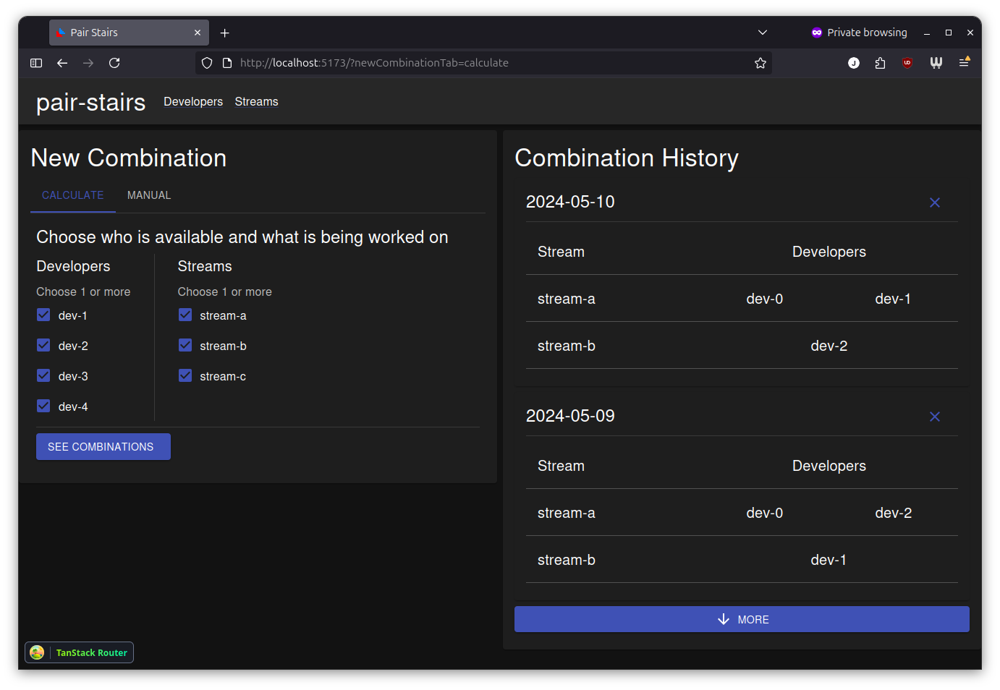

# pair-stairs

This is a tool for helping developers in a team, decide the combinations of how they will pair with each other.

## Web application

Introduced as of 1.4.0 there is now a web application to make it easier for teams to choose their combinations.

It consists of a [React](frontend/README.md), a [Spring Boot backend](backend/README.md) and a database for
persistence.

The application is shipped as docker image, please see the [README.md](docker/README.md)
for instructions on how to bring this stack up yourself.

## CLI

Initially this project was a CLI only tool. For now, this is in maintenance mode in favour of the web application.

You can find more about it in the [legacy](legacy/README.md) module.

## Core

The core business logic of pair-stairs now resides in its own module [core](core/README.md).

The algorithm for determining combinations is in here.

## Building the project

The basic requirements to build are:

- Make
  - This is likely already available on your system if you are a developer
- Java
  - This can be downloaded and managed with [SDKMAN](https://sdkman.io/install)
  - The version is defined in [.sdkmanrc](.sdkmanrc)
- Node
  - This can be downloaded and managed with [nvm](https://github.com/nvm-sh/nvm?tab=readme-ov-file#installing-and-updating)
  - The version is defined in [.nvmrc](.nvmrc)
- Maven
  - This can be downloaded and managed with the included Maven wrapper script
- Docker
  - Required to build the docker image
- Playwright
  - Instructions for installing this can be found in the [e2e](e2e/README.md) module

Once SDKMAN has been installed, run `sdk env` to download and initialise your environment with the same
version of Java used in the project.

Once nvm has been installed, run `nvm use` to download and initialise your environment with the same
version of Node used in the project.

You should now be able to build the project using `make build`.